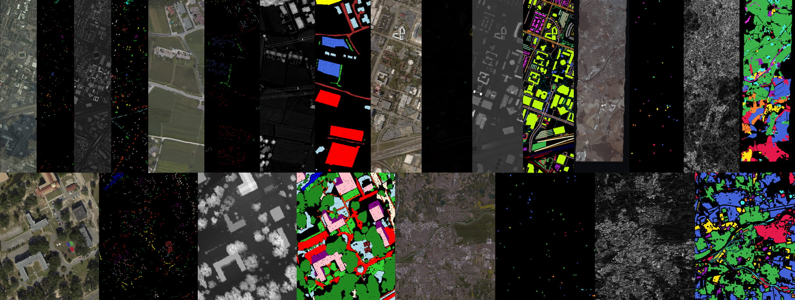

# rs-fusion-datasets

[](https://pypi.org/project/rs-fusion-datasets)
[](https://pypi.org/project/rs-fusion-datasets)
[](https://pypi.org/project/rs-fusion-datasets)


rs-fusion-datasets is a remote sensing data-fetcher and data-loader for joint classification of hyperspectral, LiDAR and SAR data. rs-fusion-datasets is a Python package that:
1. Automatically downloads and load many multimodel remote sensing datasets (houston, muufl, trento, berlin, augsburg, etc.)
2. Provides ready-to-use torch dataloaders
3. Provides utils for visulization, dataset spilit, benchmark, hsi to rgb, etc.




> This project is still under development, API is not reiliable before v1.0.0.

## Datasets

|Dataset|Fetcher Function|Torch Dataset | Bands | Note|
|---|---|---|---|---|
|[Houston 2013](https://machinelearning.ee.uh.edu/?page_id=459)|`fetch_houston2013`|`Houston2013`| HSI,LiDAR | |
|Trento|`fetch_trento`|`Trento`| HSI,LiDAR | |
|[MUUFL](https://doi.org/10.5281/zenodo.1186326)|`fetch_muufl`|`Muufl`| HSI,LiDAR | |
|[Houston 2018](https://machinelearning.ee.uh.edu/2018-ieee-grss-data-fusion-challenge-fusion-of-multispectral-lidar-and-hyperspectral-data/)|`fetch_houston2018_ouc`|`Houston2018Ouc`| HSI,LiDAR | |
|[Augsburg](https://mediatum.ub.tum.de/1657312)|`fetch_augsburg_ouc`|`AugsburgOuc`| HSI,SAR | aka. MDAS |
|[Berlin](https://gfzpublic.gfz-potsdam.de/pubman/faces/ViewItemFullPage.jsp?itemId=item_1480927_5)|`fetch_berlin_ouc`|`BerlinOuc`| HSI,SAR | |


## Quick Start
### Install
```bash
pip install rs-fusion-datasets
```

### Use with torch
```python
from rs_fusion_datasets import Houston2013, Trento, Muufl, Houston2018Ouc, BerlinOuc, AugsburgOuc
dataset = Muufl('train', patch_size=11)
x_h, x_l, y, extras = dataset[0]
```

### Get the raw image and labels
```python
from rs_fusion_datasets import fetch_houston2013, fetch_muufl, fetch_trento, split_spmatrix
# For Houston 2013
hsi, dsm, train_label, test_label, info = fetch_houston2013()
# For Muufl and Trento
casi, lidar, truth, info = fetch_muufl()
train_label, test_label = split_spmatrix(truth, 20)
# For fetch_houston2018_ouc, fetch_augsberg_ouc, fetch_berlin_ouc
hsi, dsm, train_label, test_label, all_label, info = fetch_houston2018_ouc()
```

> [!TIP]
> The labels returned are [sparse matrix](https://docs.scipy.org/doc/scipy/reference/generated/scipy.sparse.coo_array.html), you can either convert them to np.array easily by
> ```python
> train_label=train_label.todense()
> test_label =test_label.todense()
> ```
> Or directly use them for getting the value in a very fast way:
> ```python
>     def __getitem__(self, index):
>       i = self.truth.row[index]
>       j = self.truth.col[index]
>       label = self.truth.data[index].item()
>       x_hsi = self.hsi[:, i, j]
>       x_dsm = self.dsm[:, i, j]
>       return x_hsi, x_dsm, label
> ```


### Utils
1. `<Dataset>.benchmarker` and `ClassificationMapper`: Draw the predicted labels, compute the confusion matrix, OA, AA, CA, Kappa. For the usage, see [demo_torch.py](tests/demo_torch.py) 
2. `<Dataset>.lbl2rgb` and `lbl2rgb`: Convert the label of dataset to rgb image for visulization
3. `<Dataset>.hsi2rgb` and `hsi2rgb`: Convert HSI to true color RGB
4. `read_roi`: Read exported `.txt` file of ENVI roi to sparse matrix
5. `split_spmatrix`: Split a sparse to get the train dataset and test dataset


## Help
- [PyTorch Demo: train your model in 70 lines of code with rs-fusion-datasets](tests/demo_torch.py)
- [User Manual](https://github.com/songyz2019/rs-fusion-datasets/wiki/Usage)
- [Developer Manual](https://github.com/songyz2019/rs-fusion-datasets/wiki/Development)
- [Test cases](tests/test.py)


## Star History

[](https://www.star-history.com/#songyz2019/rs-fusion-datasets&Date)

## Contribution
We welcome all contributions, including issues, pull requests, feature requests and discussions.

## License
```text
Copyright 2023-2025 songyz2019

Licensed under the Apache License, Version 2.0 (the "License");
you may not use this file except in compliance with the License.
You may obtain a copy of the License at

http://www.apache.org/licenses/LICENSE-2.0

Unless required by applicable law or agreed to in writing, software
distributed under the License is distributed on an "AS IS" BASIS,
WITHOUT WARRANTIES OR CONDITIONS OF ANY KIND, either express or implied.
See the License for the specific language governing permissions and
limitations under the License.
```

## Credits
```text
Augsburg:
The data is publicly available at 10.14459/2022mp1657312. If you use this data set, please cite our paper.
@article{hu2022mdas,
  title={MDAS: A New Multimodal Benchmark Dataset for Remote Sensing},
  author={Hu, Jingliang and Liu, Rong and Hong, Danfeng and Camero, Andr{\'e}s and Yao, Jing and Schneider, Mathias and Kurz, Franz and Segl, Karl and Zhu, Xiao Xiang},
  journal={Earth System Science Data Discussions},
  pages={1--26},
  year={2022},
  publisher={Copernicus GmbH},
  doi={10.5194/essd-2022-155}
}

Berlin:
Okujeni, A.; Van Der Linden, S.; Hostert, P. Berlin-Urban-Gradient dataset 2009—An EnMAP Preparatory Flight
 Campaign (Datasets); GFZ Data Services: Potsdam, Germany, 2016.

Houston2018: 
https://machinelearning.ee.uh.edu/2018-ieee-grss-data-fusion-challenge-fusion-of-multispectral-lidar-and-hyperspectral-data/
The dataset can be downloaded here subject to the terms and conditions listed below. If you wish to use the data, please be sure to email us and provide your Name, Contact information, affiliation (University, research lab etc.), and an acknowledgement that you will cite this dataset and its source appropriately, as well as provide an acknowledgement to the IEEE GRSS IADF and the Hyperspectral Image Analysis Lab at the University of Houston, in any manuscript(s) resulting from it.

Houston2013: 
https://machinelearning.ee.uh.edu/?page_id=459
The 2013_IEEE_GRSS_DF_Contest_Samples_VA.txt in this repo is exported from original 2013_IEEE_GRSS_DF_Contest_Samples_VA.roi.
The dataset was collected by NCALM at the University of Houston (UH) in June 2012, covering the University of Houston campus. The data was prepared and pre-processed with the assistance of Xiong Zhou, Minshan Cui, Abhinav Singhania and Dr. Juan Carlos Fernández Díaz.
The Data Fusion Technical Committee would like to express its great appreciation to NCALM for providing the data, to UH students, staff and faculty for preparing the data, and to GRSS and DigitalGlobe Inc. for their continuous support in providing funding and resources for the Data Fusion Contest.

Muufl:
https://github.com/GatorSense/MUUFLGulfport
Note: If this data is used in any publication or presentation the following reference must be cited:
P. Gader, A. Zare, R. Close, J. Aitken, G. Tuell, “MUUFL Gulfport Hyperspectral and LiDAR Airborne Data Set,” University of Florida, Gainesville, FL, Tech. Rep. REP-2013-570, Oct. 2013.
If the scene labels are used in any publication or presentation, the following reference must be cited:
X. Du and A. Zare, “Technical Report: Scene Label Ground Truth Map for MUUFL Gulfport Data Set,” University of Florida, Gainesville, FL, Tech. Rep. 20170417, Apr. 2017. Available: http://ufdc.ufl.edu/IR00009711/00001.
If any of this scoring or detection code is used in any publication or presentation, the following reference must be cited:
T. Glenn, A. Zare, P. Gader, D. Dranishnikov. (2016). Bullwinkle: Scoring Code for Sub-pixel Targets (Version 1.0) [Software]. Available from https://github.com/GatorSense/MUUFLGulfport/.

Trento:
Dafault url of Trento dataset is https://github.com/tyust-dayu/Trento/tree/b4afc449ce5d6936ddc04fe267d86f9f35536afd

About GitHub hosted dataset in rs-fusion-datasets-dist:
All datasets are public available for download but I can't find any direct link for automatically loading (for example, the author uploads it via net disk apps).
The suffix of dataset is only an 3-character UID. I upload these dataset AS IS, without editing anything, and make sure it is just a mirror.
`augsburg-ouc`: From https://github.com/oucailab/DCMNet/
`berlin-ouc`: From https://github.com/oucailab/DCMNet/
`houston2018-ouc`: From https://github.com/oucailab/DCMNet/
`houston2013-mmr`: From: https://github.com/likyoo/Multimodal-Remote-Sensing-Toolkit/

Inspiration
This project is inspired by torchgeo and torchrs
```
