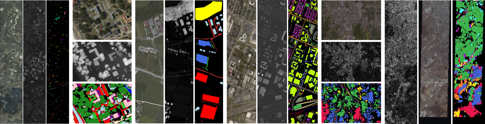
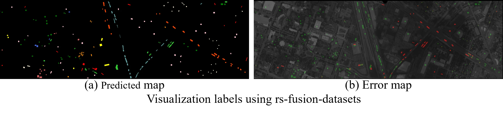

# rs-fusion-datasets

[](https://pypi.org/project/rs-fusion-datasets)
[](https://pypi.org/project/rs-fusion-datasets)
[](https://pypi.org/project/rs-fusion-datasets)


**rs-fusion-datasets** is a Python package for frictionless multimodal remote sensing data handling.
It simplifies the workflow for joint classification of Hyperspectral and LiDAR/SAR data with the following features:

- **Out-of-the-Box PyTorch Dataloaders**: Provides standardized PyTorch [Datasets API](https://docs.pytorch.org/tutorials/beginner/basics/data_tutorial.html) with automated  downloading, loading and preprocessing.
- **Rich Toolkit**: Built-in utilities for HSI-to-RGB conversion, label mapping, dataset splitting, and automated metric calculation (Confusion Matrix, CA, OA, AA, Kappa).
- **Raw Data Access**: Direct raw data APIs for non-deep learning workflows, allowing to build traditional ML baselines without PyTorch dependencies.



| Dataset                                                                                                                                   | Source                                                                                        | Fetcher Function          | Torch Dataset      | Modals    | Note                                                                                         |
| ----------------------------------------------------------------------------------------------------------------------------------------- | --------------------------------------------------------------------------------------------- | ------------------------- | ------------------ | --------- | -------------------------------------------------------------------------------------------- |
| [Houston 2013](https://machinelearning.ee.uh.edu/?page_id=459)                                                                               | [Official Website](https://machinelearning.ee.uh.edu/?page_id=459)                               | `fetch_houston2013`     | `Houston2013`    | HSI,LiDAR |                                                                                              |
| [Houston 2013](https://machinelearning.ee.uh.edu/?page_id=459)                                                                               | [S2ENet](https://github.com/likyoo/Multimodal-Remote-Sensing-Toolkit/)                           | `fetch_houston2013_mmr` | `Houston2013Mmr` | HSI,LiDAR |                                                                                              |
| Trento                                                                                                                                    | [tyust-dayu](https://github.com/tyust-dayu/Trento/tree/b4afc449ce5d6936ddc04fe267d86f9f35536afd) | `fetch_trento`          | `Trento`         | HSI,LiDAR |                                                                                              |
| [MUUFL](https://doi.org/10.5281/zenodo.1186326)                                                                                              | [Official GitHub](https://github.com/GatorSense/MUUFLGulfport/tree/v0.1)                         | `fetch_muufl`           | `Muufl`          | HSI,LiDAR |                                                                                              |
| [Houston 2018](https://machinelearning.ee.uh.edu/2018-ieee-grss-data-fusion-challenge-fusion-of-multispectral-lidar-and-hyperspectral-data/) | [DCMNet](https://github.com/oucailab/DCMNet)                                                     | `fetch_houston2018_ouc` | `Houston2018Ouc` | HSI,LiDAR | May have [different channel numbers](https://github.com/songyz2019/rs-fusion-datasets/issues/12) |
| [Augsburg](https://mediatum.ub.tum.de/1657312)                                                                                               | [DCMNet](https://github.com/oucailab/DCMNet)                                                     | `fetch_augsburg_ouc`    | `AugsburgOuc`    | HSI,SAR   |                                                                                              |
| [Berlin](https://gfzpublic.gfz-potsdam.de/pubman/faces/ViewItemFullPage.jsp?itemId=item_1480927_5)                                           | [DCMNet](https://github.com/oucailab/DCMNet)                                                     | `fetch_berlin_ouc`      | `BerlinOuc`      | HSI,SAR   |                                                                                              |

## Quick Start

### Install

```sh
pip install rs-fusion-datasets
```

### PyTorch Datasets

PyTorch Datasets work out-of-the-box with automated downloading, splitting and cropping.

```python
from rs_fusion_datasets import Houston2013
from torch.utils.data import DataLoader
testset = Houston2013('test', patch_size=11)
for x_h, x_l, y, extras in DataLoader(testset, batch_size=64):
    print('x_h', x_h.shape) # (64, 144, 11, 11)
    print('x_l', x_l.shape) # (64,   1, 11, 11)
    print('y'  , y.shape)   # (64,  15,  1)
```

### Benchmarking and Visulazation

The `benchmarker` of datasets can visualize the predicted labels and compute the confusion matrix, OA, AA, CA, Kappa.

```python
import torch
from torch.utils.data import DataLoader
from rs_fusion_datasets import AugsburgOuc

testset = AugsburgOuc('test', patch_size=9)
benchmarker = testset.benchmarker()

for hsi, dsm, lbl, ext in DataLoader(testset, batch_size=64, drop_last=True):
    y_hat = torch.randn(64, testset.n_class)
    benchmarker.add_sample(ext['location'], y_hat, lbl)

print(f"OA: {benchmarker.oa()}, AA: {benchmarker.aa()}, Kappa: {benchmarker.kappa()}")
predicted_map = benchmarker.predicted_image()                          # Full predicted label map, CHW format
error_map     = benchmarker.error_image( underlying=testset.hsi2rgb()) # Spatial distribution of errors, CHW format
```



### Raw Data Access

Direct raw data APIs are provided for accessing raw and full data.

```python
from rs_fusion_datasets import fetch_muufl, split_spmatrix
hsi, dsm, label, info = fetch_muufl()
print('hsi', hsi.shape)   # (64, 325, 220)
print('dsm', dsm.shape)   # ( 1, 325, 220)
print(label.shape)        # (325, 220)
train_label, test_label = split_spmatrix(label, n_sample_perclass=20)
assert len(train_label.data) == 20 * info['n_class']
```

| Function |   Returns   |
| ------ | ----- |
| `fetch_houston2013`     | `HSI, DSM, TrainLabel, TestLabel, Info` |
| `fetch_houston2013_mmr` | `HSI, DSM, TrainLabel, TestLabel, Info` |
| `fetch_trento`          | `HSI, DSM, FullLabel, Info` |
| `fetch_muufl`           | `HSI, DSM, FullLabel, Info` |
| `fetch_houston2018_ouc` | `HSI, DSM, TrainLabel, TestLabel, FullLabel, Info` |
| `fetch_augsburg_ouc`    | `HSI, DSM, TrainLabel, TestLabel, FullLabel, Info` |
| `fetch_berlin_ouc`      | `HSI, DSM, TrainLabel, TestLabel, FullLabel, Info` |

### Dataset Splitting

Default splitting:

```python
from rs_fusion_datasets import Houston2013
trainset = Houston2013('train', patch_size=9) # 2832  samples
testset  = Houston2013('test' , patch_size=9) # 12197 samples
```

Sampling 20 samples in every class:

```python
trainset = Houston2013('train', patch_size=9, n_train_perclass=20) # 20*n_class
testset  = Houston2013('test' , patch_size=9, n_train_perclass=20) # the rest
```

Sampling 10% in every class:

```python
trainset = Houston2013('train', patch_size=9, n_train_perclass=0.1) # 10%
testset  = Houston2013('test' , patch_size=9, n_train_perclass=0.1) # the rest
```

## Help

- [PyTorch Demo: train your model in about 70 lines of code with rs-fusion-datasets](tests/demo_torch.py)
- [PyTorch Full Demo: a more powerful showcase of rs-fusion-datasets](tests/demo_torch_full.py)
- [User Manual](https://github.com/songyz2019/rs-fusion-datasets/wiki/Usage)
- [Developer Manual](https://github.com/songyz2019/rs-fusion-datasets/wiki/Development)
- [Test cases](tests/test.py)

## Maintaince Status

This project is under **passive maintenance**, focusing on critical bugs, security, and documentation. Related issues and PRs are welcomed.
If you are interested in take over the project or have alternative recommendations, please feel free to [open an issue](https://github.com/songyz2019/rs-fusion-datasets/issues).

## Known Issues

> [!IMPORTANT]
>
> 1. `version <=0.18.3` has a [serious bug](https://github.com/songyz2019/rs-fusion-datasets/releases/tag/v0.18.3) when using `benchmarker.predicted_image()`. This is fixed in the later versions.
> 2. `version <= 0.18.4` has a [critical bug](https://github.com/songyz2019/rs-fusion-datasets/issues/14) when using `fetch_houston2013` and `Houston2013` with 30 samples not loaded. `fetch_houston2013_mmr` and `Houston2013Mmr` is not affected. This is fixed in the later versions.

## Star History

[](https://www.star-history.com/#songyz2019/rs-fusion-datasets&Date)

## License

```text
Copyright 2023-2026 songyz2019

Licensed under the Apache License, Version 2.0 (the "License");
you may not use this file except in compliance with the License.
You may obtain a copy of the License at

http://www.apache.org/licenses/LICENSE-2.0

Unless required by applicable law or agreed to in writing, software
distributed under the License is distributed on an "AS IS" BASIS,
WITHOUT WARRANTIES OR CONDITIONS OF ANY KIND, either express or implied.
See the License for the specific language governing permissions and
limitations under the License.
```

## Acknowledgments

We gratefully acknowledge the following individuals and organizations for making this project possible:

- The authors of [DCMNet](https://github.com/oucailab/DCMNet) for making their processed datasets available. Their efforts in significantly minimizing the distribution size made it possible for us to efficiently distribute and utilize the data.
- The authors of [S2ENet](https://github.com/likyoo/Multimodal-Remote-Sensing-Toolkit/) for making their processed Houston 2013 dataset available.
- The authors of the [Augsburg](https://mediatum.ub.tum.de/1657312) dataset.
  ```bibtex
  @article{hu2022mdas,
    title={MDAS: A New Multimodal Benchmark Dataset for Remote Sensing},
    author={Hu, Jingliang and Liu, Rong and Hong, Danfeng and Camero, Andr{\'e}s and Yao, Jing and Schneider, Mathias and Kurz, Franz and Segl, Karl and Zhu, Xiao Xiang},
    journal={Earth System Science Data Discussions},
    pages={1--26},
    year={2022},
    publisher={Copernicus GmbH},
    doi={10.5194/essd-2022-155}}
  ```
- The authors of the [Berlin](https://gfzpublic.gfz-potsdam.de/pubman/faces/ViewItemFullPage.jsp?itemId=item_1480927_5) dataset.
  ```text
  Okujeni, A.; Van Der Linden, S.; Hostert, P. Berlin-Urban-Gradient dataset 2009—An EnMAP Preparatory Flight Campaign (Datasets); GFZ Data Services: Potsdam, Germany, 2016.
  ```
- The authors of the [Houston 2018](https://machinelearning.ee.uh.edu/2018-ieee-grss-data-fusion-challenge-fusion-of-multispectral-lidar-and-hyperspectral-data/) dataset.
  ```text
  The dataset can be downloaded here subject to the terms and conditions listed below. If you wish to use the data, please be sure to email us and provide your Name, Contact information, affiliation (University, research lab etc.), and an acknowledgement that you will cite this dataset and its source appropriately, as well as provide an acknowledgement to the IEEE GRSS IADF and the Hyperspectral Image Analysis Lab at the University of Houston, in any manuscript(s) resulting from it.
  ```
- The authors of the [Houston2013](https://machinelearning.ee.uh.edu/?page_id=459) dataset. The `2013_IEEE_GRSS_DF_Contest_Samples_VA.txt` in this repo is exported from original `2013_IEEE_GRSS_DF_Contest_Samples_VA.roi`.
  ```text
  The dataset was collected by NCALM at the University of Houston (UH) in June 2012, covering the University of Houston campus. The data was prepared and pre-processed with the assistance of Xiong Zhou, Minshan Cui, Abhinav Singhania and Dr. Juan Carlos Fernández Díaz.
  The Data Fusion Technical Committee would like to express its great appreciation to NCALM for providing the data, to UH students, staff and faculty for preparing the data, and to GRSS and DigitalGlobe Inc. for their continuous support in providing funding and resources for the Data Fusion Contest.
  ```
- The authors of the [Muufl](https://doi.org/10.5281/zenodo.1186326) dataset.
  ```text
  Note: If this data is used in any publication or presentation the following reference must be cited:
  P. Gader, A. Zare, R. Close, J. Aitken, G. Tuell, “MUUFL Gulfport Hyperspectral and LiDAR Airborne Data Set,” University of Florida, Gainesville, FL, Tech. Rep. REP-2013-570, Oct. 2013.
  If the scene labels are used in any publication or presentation, the following reference must be cited:
  X. Du and A. Zare, “Technical Report: Scene Label Ground Truth Map for MUUFL Gulfport Data Set,” University of Florida, Gainesville, FL, Tech. Rep. 20170417, Apr. 2017. Available: http://ufdc.ufl.edu/IR00009711/00001.
  If any of this scoring or detection code is used in any publication or presentation, the following reference must be cited:
  T. Glenn, A. Zare, P. Gader, D. Dranishnikov. (2016). Bullwinkle: Scoring Code for Sub-pixel Targets (Version 1.0) [Software]. Available from https://github.com/GatorSense/MUUFLGulfport/.
  ```
- The authors of the Trento dataset. Dafault url of Trento dataset is `https://github.com/tyust-dayu/Trento/tree/b4afc449ce5d6936ddc04fe267d86f9f35536afd`
- GitHub for hosting some dataset files. [rs-fusion-datasets-dist](https://github.com/songyz2019/rs-fusion-datasets-dist) host some dataset files that are public available for download but have no direct link found for automatically downloading (for example, the author uploads it via net disk apps). The suffix of dataset is only an 3-character UID. I upload these dataset AS IS, without editing anything, making sure it is just a mirror.
- The authors of [torchgeo](https://github.com/torchgeo/torchgeo). This project is inspired by torchgeo
- The authors of [torchrs](https://github.com/isaaccorley/torchrs). This project is inspired by torchrs
